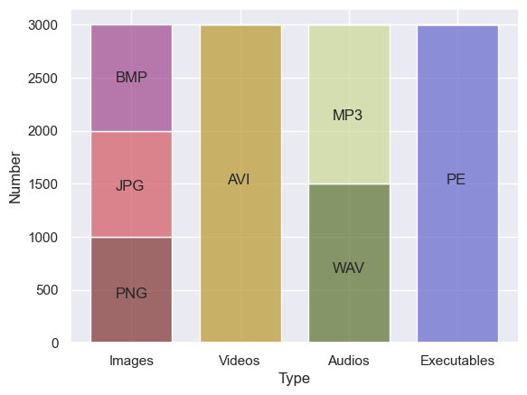
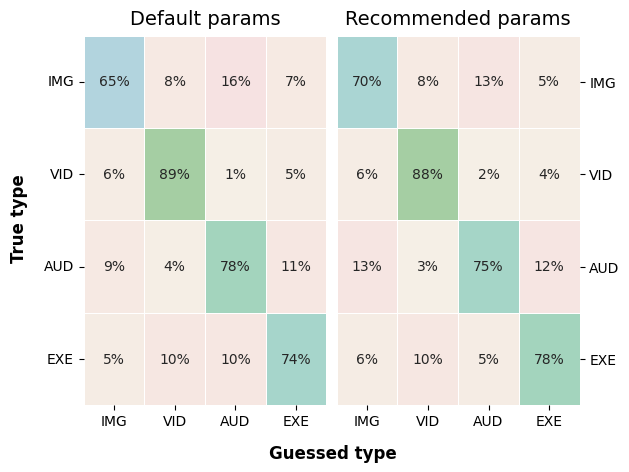

<p align="center">
	<code>[ Have a look at the related <a href="https://github.com/jupyter/notebook">Jupyter</a> Notebook: <a href="ML-Corrupted.ipynb"><code>ML-Corrupted.ipynb</code></a> ]</code><br>
	<code>[!] This README is only a brief overview of the notebook contents!</code><br><br>
	<b>
		<a href="#-problem">Problem</a> | 
		<a href="#-results">Results</a> | 
		<a href="#-approach">Approach</a> | 
		<a href="#-resources">Resources</a>
	</b>
</p><br>

> // **Disclaimer:**<br>
> &nbsp; I created this out of interest in the summer of 2019 at the age of 15<br>
> &nbsp; [Resources](#-resources), links and libraries were updated in the spring of 2022<br>
> → `Machine Learning level: Script Kiddie`

# 📉 Problem
Solving CTF tasks led me to corrupted files at some point. When they lack distinctive features, such as [signatures](https://en.wikipedia.org/wiki/List_of_file_signatures), most of the tools identify them as "`Text files`" or "`Data`", which is not useful at all, to be honest.

To proceed, it would be great to know their types, at least.
Even though some files might be too broken to be fixed, unless you know the exact file format, which parts are missing and which part you have got before your eyes, I believe that guessing types may still be useful in some cases, e.g. criminal investigations — it might be important to find remains of what used to be evidences and analyze them thoroughly. 
Thus, my aim was to build models that would guess types of broken files.

# 📊 Results

<p align="center">
	<br>
	<code align="center">Test set of files + knnRecG8 (<code>./guess</code>)</code>
</p>


# 🔍 Approach
### Data
[`> Resources`](#-resources) &nbsp; [ _Every piece of data and all copyrights belong to the original owners_ ]

- 🎨 **Images** (Raster)
    - (Uncompressed) `BMP`: [General-100 Dataset](http://mmlab.ie.cuhk.edu.hk/projects/FSRCNN.html) `[1]` + random files gathered from the Internet
    - (Lossy compression) `JPEG`: [UTKFace: Large Scale Face Dataset](https://susanqq.github.io/UTKFace/) `[2]`
    - (Lossless compression) `PNG`: random files gathered from the Internet
- 🎬 **Videos**
    - `AVI`: [HMDB: A Large Video Database for Human Motion Recognition](http://serre-lab.clps.brown.edu/resource/hmdb-a-large-human-motion-database/) `[3]`
- 🎧 **Audios**
    - (Uncompressed) `WAV`: [FSDnoisy18k](http://www.eduardofonseca.net/FSDnoisy18k/) `[4]`
    - (Lossy compression) `MP3`: [Mozilla Common Voice Dataset](https://commonvoice.mozilla.org/en/datasets)
- ⚙️ **Executables**
    - Portable Executables: [Microsoft Malware Classification Challenge](https://www.kaggle.com/c/malware-classification/) `[5]`

<p alt="File formats distribution + file count histogram" align="center"></p>


## Features
A total of 7 DataFrames were made:
> 1. `S`   = Top 10 bytes in each part of a file (file is split into 3 parts)
> 2. `G4`  = Top 20 byte 4-Grams (stride=1) in a file
> 3. `G6`  = Top 20 byte 6-Grams (stride=2) in a file
> 4. `G8`  = Top 20 byte 8-Grams (stride=4) in a file
> 5. `G4S` = Top 10 byte 4-Grams (stride=1) in each part of a file (file is split into 3 parts)
> 6. `G6S` = Top 10 byte 6-Grams (stride=2) in each part of a file (file is split into 3 parts)
> 7. `G8S` = Top 10 byte 8-Grams (stride=4) in each part of a file (file is split into 3 parts)
> 
> `S` → Split, `GN` → [N-Grams](https://en.wikipedia.org/wiki/N-gram)


## Algorithms & boosts
[Scikit-Learn](https://github.com/scikit-learn/scikit-learn) + [XGBoost](https://github.com/dmlc/xgboost) + [LightGBM](https://github.com/microsoft/LightGBM) + [CatBoost](https://github.com/catboost/catboost):
```python
from sklearn.ensemble import RandomForestClassifier      # Random Forest Classifier
from sklearn.neighbors import KNeighborsClassifier       # KNN Classifier
from xgboost import XGBClassifier                        # XGBoost Classifier
from lightgbm import LGBMClassifier                      # LightGBM Classifier
from catboost import CatBoostClassifier                  # CatBoost Classifier

from sklearn.model_selection import RandomizedSearchCV   # Randomized search on hyperparameters
```
Models were built using every algorithm listed above and were trained based on every DataFrame [specified](#features). For each case there are two models: one with default settings and one with [hyperparameters](https://en.wikipedia.org/wiki/Hyperparameter_(machine_learning)) recommended by [`RandomizedSearchCV`](https://scikit-learn.org/stable/modules/generated/sklearn.model_selection.RandomizedSearchCV.html). 


The total number of models is 70 _(7 DataFrames * 5 Algorithms * 2 Sets of hyperparameters)_:
```
rfcS, rfcRecS, rfcG4, rfcRecG4, rfcG6, rfcRecG6, rfcG8, rfcRecG8, rfcG4S, rfcRecG4S, rfcG6S, rfcRecG6S, rfcG8S, rfcRecG8S,
knnS, knnRecS, knnG4, knnRecG4, knnG6, knnRecG6, knnG8, knnRecG8, knnG4S, knnRecG4S, knnG6S, knnRecG6S, knnG8S, knnRecG8S,
xgbS, xgbRecS, xgbG4, xgbRecG4, xgbG6, xgbRecG6, xgbG8, xgbRecG8, xgbG4S, xgbRecG4S, xgbG6S, xgbRecG6S, xgbG8S, xgbRecG8S,
lgbmS, lgbmRecS, lgbmG4, lgbmRecG4, lgbmG6, lgbmRecG6, lgbmG8, lgbmRecG8, lgbmG4S, lgbmRecG4S, lgbmG6S, lgbmRecG6S, lgbmG8S, lgbmRecG8S,
cbcS, cbcRecS, cbcG4, cbcRecG4, cbcG6, cbcRecG6, cbcG8, cbcRecG8, cbcG4S, cbcRecG4S, cbcG6S, cbcRecG6S, cbcG8S, cbcRecG8S
```


## Accuracy calculation & comparison
```python
from sklearn.metrics import accuracy_score               # Accuracy score

# [ Accuracy Score = (True Positives + True Negatives) / (True Positives + False Positives + True Negatives + False Negatives) ]
```

Also, heatmaps were used to visually compare accuracy scores of predictions _(on validation sets)_ of different models. For example, the heatmap below depicts the difference between K-Nearest Neighbors model _(train dataset = `G8`)_ with default hyperparameters _(`knnG8`)_ and the ones recommended by `RandomizedSearchCV` _(`knnRecG8`)_:

<p alt="Heatmap (KNN, G8)" align="center"></p>


## Libraries
| Data processing | Algorithms & boosting | Visualization | Misc |
| :-: | :-: | :-: | :-: |
| `numpy 1.21.6` | `scikit-learn 1.0.2` | `matplotlib 3.5.2` | `binascii` |
| `pandas 1.3.5` | `xgboost 1.6.1` | `seaborn 0.11.2` | `collections` |
| | `lightgbm 3.3.2` | | `tqdm 4.35.0` |
| | `catboost 1.0.6` | | `dill 0.3.5.1` |
	
	
## Hardware
Information regarding hardware that was used to run [the notebook](ML-Corrupted.ipynb).
The time spent on every crucial step may be seen in the notebook, next to each **tqdm** progress bar.

> RAM: `12 GB`<br>
> GPU: `NVIDIA GeForce GTX 1060`<br>
> Processor: `Intel(R) Core(TM) i5-8300H`


# 📚 Resources
### Datasets:
>`[1]` Chao Dong, Chen Change Loy, Xiaoou Tang. Accelerating the Super-Resolution Convolutional Neural Network, in Proceedings of European Conference on Computer Vision (ECCV), 2016 [arXiv:1608.00367](https://arxiv.org/abs/1608.00367)<br>
>
>`[2]` Zhang Zhifei, Song Yang, and Qi Hairong. "Age Progression/Regression by Conditional Adversarial Autoencoder". IEEE Conference on Computer Vision and Pattern Recognition (CVPR). [arXiv:1702.08423](https://arxiv.org/abs/1702.08423), 2017<br>
>
>`[3]` H. Kuehne, H. Jhuang, E. Garrote, T. Poggio, and T. Serre. HMDB: A Large Video Database for Human Motion Recognition. ICCV, 2011. [PDF](http://serre-lab.clps.brown.edu/wp-content/uploads/2012/08/Kuehne_etal_iccv11.pdf) [Bibtex](http://serre-lab.clps.brown.edu/wp-content/uploads/2013/10/Kuehne_etal_iccv11.bib)<br>
>
>`[4]` Eduardo Fonseca, Manoj Plakal, Daniel P. W. Ellis, Frederic Font, Xavier Favory, and Xavier Serra, “Learning Sound Event Classifiers from Web Audio with Noisy Labels”, arXiv preprint [arXiv:1901.01189](https://arxiv.org/abs/1901.01189), 2019<br>
>
>`[5]` Royi Ronen, Marian Radu, Corina Feuerstein, Elad Yom-Tov, Mansour Ahmadi. "Microsoft Malware Classification Challenge". [arXiv:1802.10135](https://arxiv.org/abs/1802.10135), 2018
